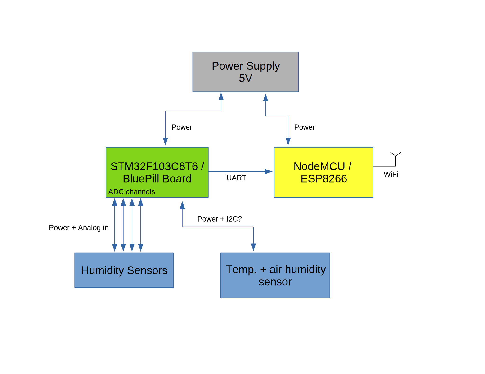

# TiefhofControl

A humidity sensor and weather station application for a "outdoor basement" garden with patches and beds, called the Tiefhof.

The goal is to measure the humidity of the beds and certain other quantities and report them over the internet to a database. A website with Grafana is then used to monitor the status of the Tiefhof. Further investigations later on may include automated control of watering or the like. The future is inscrutable, we will see, where this leads us.

This project is implemented together with a few other friends, mainly just starting out on electronics and progamming, and they are meant to maintain this thing further, so there shall exist a focus on documentation(tm) and easy explanations (whatever this means... ^^).

## Structure

* `overview.pdf` depicts a block circuit diagram of all the components and their interaction
* `/firmware/NodeMCU/` contains the firmware for the NodeMCU/ESP8266 controller, that does WiFi and reporting the data
* `/firmware/STM32/` contains the firmware for the STM32F103 controller, that handles all the sensors
* `/monitoring/` contains documentation on how to set up the server with database, website with Grafana etc.

## Overview

First draft of things

